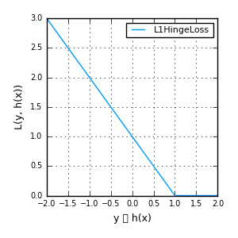
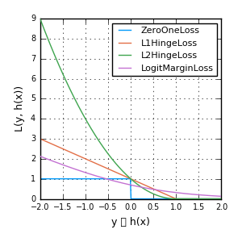
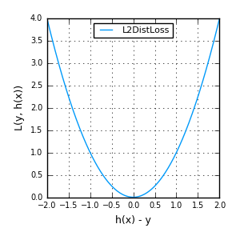
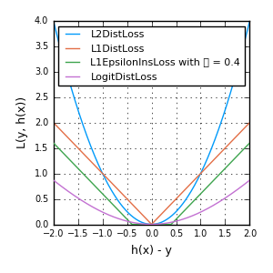
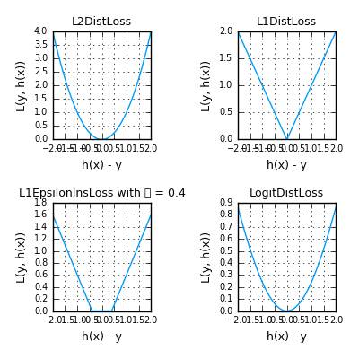
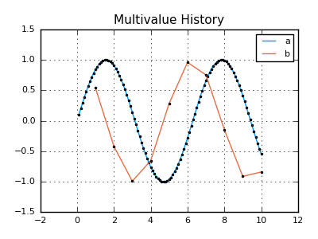

# MLPlots

[](https://travis-ci.org/JuliaML/MLPlots.jl)

Common plotting recipes for statistics and machine learning.

This package uses [Plots.jl](https://github.com/tbreloff/Plots.jl) to provide high-level statistical and machine learning plotting
recipes which are independent of both the platform and graphical library.

There are plotting recipes for external packages which are conditionally included and are loaded on the relevant `using` call.
For example `using LearnBase, MLPlots` will load plotting recipes for loss functions defined in LearnBase.  Recipes include:

- Correlation grid (`corrplot`)
- [LearnBase](https://github.com/Evizero/LearnBase.jl): Loss functions
- [ValueHistories](https://github.com/JuliaML/ValueHistories.jl): Tracked values over time
- [OnlineAI](https://github.com/tbreloff/OnlineAI.jl): Neural nets and spike trains
- [ROCAnalysis](https://github.com/davidavdav/ROCAnalysis.jl): ROC/AUC curves

#### Status: This package is usable and tested, but needs more content.  Collaboration is welcomed and encouraged!

---

LearnBase:

```julia
plot(LossFunctions.HingeLoss())
```



```julia
plot([ZeroOneLoss(), L1HingeLoss(), L2HingeLoss(), LogitMarginLoss()])
```



```julia
subplot([ZeroOneLoss(), L1HingeLoss(), L2HingeLoss(), LogitMarginLoss()], size=(400,400))
```


```julia
plot(LossFunctions.L2DistLoss())
```



```julia
plot([L2DistLoss(), L1DistLoss(), EpsilonInsLoss(.4), LogitDistLoss()])
```



```julia
subplot([L2DistLoss(), L1DistLoss(), EpsilonInsLoss(.4), LogitDistLoss()], size=(400,400))
```



end

---

Correlation grids:

```julia
using MLPlots
M = randn(1000, 4)
M[:,2] += 0.8M[:,1]
M[:,3] -= 0.7M[:,1]
corrplot(M, size=(700,700))
```


---

Neural nets with OnlineAI:

```julia
using OnlineAI, MLPlots
net = buildClassificationNet(3, 1, [15,10,5])
plot(net)
```


```julia
n = 20
spikes = SpikeTrains(n, title = "Spike Trains", color = :black)
for t=1:100, i=1:n
    if rand() < 0.1
        push!(spikes, i, t)
    end
end
spikes.plt
```


---

ROC Analysis:

```julia
using ROCAnalysis, MLPlots
curve = ROCAnalysis.roc(2+2randn(1000), -2+2randn(100000))
plot(curve)
```


---

Value Histories:

```julia
using ValueHistories, MLPlots
history = ValueHistories.DynMultivalueHistory()
for i=1:100
  x = 0.1i
  push!(history, :a, x, sin(x))
  push!(history, :wrongtype, x, "$(sin(x))")
  if i % 10 == 0
    push!(history, :b, x, cos(x))
  end
end
plot(history)
```



QueueUnivalueHistory

```julia
using ValueHistories, MLPlots
history = ValueHistories.QueueUnivalueHistory(Int)
for i = 1:100
  push!(history, i, 2i)
end
plot(history)
```


VectorUnivalueHistory

```julia
using ValueHistories, MLPlots
history = ValueHistories.VectorUnivalueHistory(Int)
for i = 1:100
  push!(history, i, 100-i)
end
plot(history)
```


---
